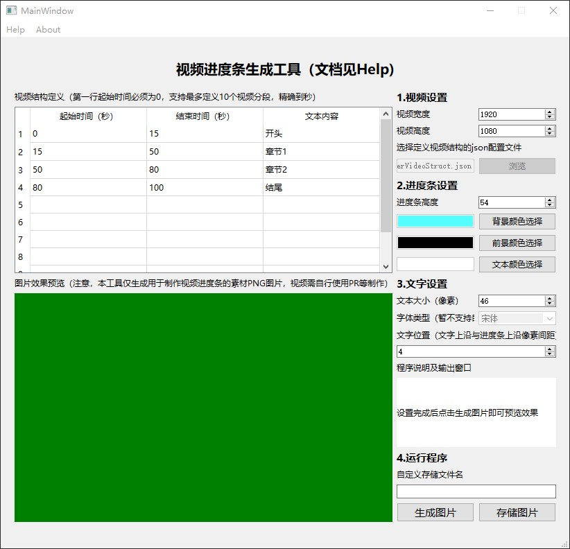
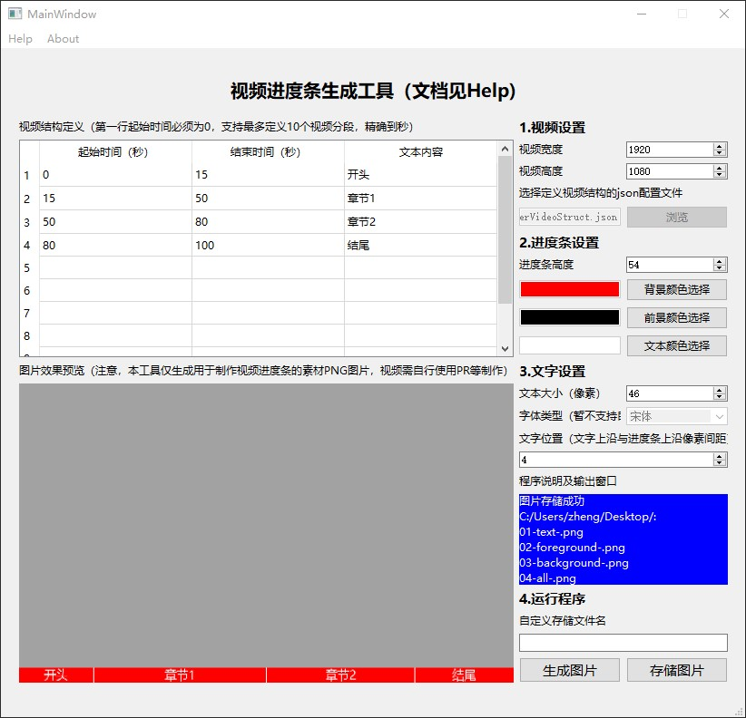

# VideoProgressBarTool-Windows
Video Progressbar Tool for windows

## 工具下载链接

该工具使用Python开发，命令行版本使用了PIL库，图形版本使用了PIL和PyQt库，目前为**Beta1版本**。

* 命令行版本支持json文件配置所有参数，放出版本支持windows平台。
* 图形版本支持图形界面配置大部分参数，支持windows平台。

目前命令行版的源码已放出，即`main.py`。

最新的命令行版本：

[github下载链接](https://github.com/ZhengMingpei/VideoProgressBarTool-Windows/releases/download/cli-beta1/VideoProgressBarTool-Windows-x64-cli-beta1.zip)

[国内推荐gitee下载链接](https://gitee.com/zhengmingpei/VideoProgressBarTool-Windows/attach_files/845597/download/VideoProgressBarTool-Windows-x64-cli-beta1.zip)

旧的图形界面版本：

点击[这里](https://github.com/ZhengMingpei/VideoProgressBarTool-Windows/releases/tag/beta1)即可下载。

## 视频进度条生成工具

本工具是制作视频进度条的辅助小工具。

使用该工具配合AdobePremiere、Shotcut等常见视频编辑软件可以轻松实现下图所示的进度条效果：


### 功能介绍

工具的核心功能是：根据自定义配置，快速制作可以用在AdobePremiere、Shotcut等常见视频编辑器中使用的PNG图片。图片包括前景、背景和文本。

### 命令行新版本使用方法

图形界面版本过于繁琐，所以重新制作了更好用（**关键是可定制化更强**）的命令行版本。

现在只需要编辑配置文件比如`userVideoStruct.json`，然后直接将配置文件拖到`VideoProgressBarTool-Windows-x64-cli-beta1.exe`上，即可生成含png图片的文件夹，文件夹名为当前时间，文件夹内包括以下文件：

```sh
01-text.png  02-foreground.png  03-background.png  userVideoStruct.json
```

`userVideoStruct.json`的配置内容非常明显，`timeLine`定义视频结构，`video`定义视频分辨率，`processbar`定义进度条，`text`定义进度条上的文字（`cutcolor`定义分割条颜色）。

颜色的表示比如`#ffffff00`，前面的`ffffff`表示颜色，最后的`00`表示透明度（alpha值）。

```json
{
    "timeLine":
    [
        {
            "partId":1,
            "startTime":0,
            "endTime":15,
            "text":"开头"
        },
        {
            "partId":2,
            "endTime":70,
            "text":"章节1"
        },
        {
            "partId":3,
            "endTime":85,
            "text":"章节2"
        },
        {
            "partId":4,
            "endTime":100,
            "text":"结尾"
        }
    ],
    "video":
    {
        "width":1920,
        "height":1080
    },
    "processbar":
    {
        "height":54,
        "background":"#0fffff77",
        "foreground":"#00000077"
    },
    "text":
    {
        "font":"c:\\windows\\fonts\\msyh.ttc",
        "size":48,
        "color":"#ffffffee",
        "cutcolor":"#ffffff77"
    }
}
```

### 图形界面版使用方法

2021.10.5更新，建议优先使用上述命令行版本。

**默认字体为微软雅黑，暂时无法更改，字体所在目录应为`c:\\windows\\fonts\\msyh.ttc`，路径不对的请自行放置到该目录。**

解压后，会得到以下文件：

```shell
VideoProgressBarTool-Windows-x64-beta1.exe # 工具主体，双击打开运行
userVideoStruct.json   # 工具对视频内容结构的初始配置
mainWindow6.ui         # 工具的界面布局文件，没错，是第六个版本的UI。
```

上述三个文件必须在同一个目录下，json配置文件可以进行合理修改，使用记事本就可以打开编辑。

运行`VideoProgressBarTool-Windows-x64-beta1.exe`后界面如下：



进行参数配置后点击**生成图片按钮**即可预览进度条效果，生成无误以后可以点击**存储图片按钮**指定目录存储图片,运行效果如下图：



正常运行后，若指定文件名为`hello`，则将会生成符合要求的PNG图片：

```shell
01-text-hello.png
02-foreground-hello.png
03-background-hello.png
04-all-hello.png
```

## 应用工具制作视频进度条

详情见本人的[B站视频介绍](https://space.bilibili.com/32918983)

在视频素材完成剪辑后，使用本工具生成符合素材结构的PNG图片，并将01、02和03图片分别拖入视频编辑软件中，并使三个图片各自占用一条视频轨道，叠放在你自己的视频素材轨道上方。

叠放示例如图：


然后对02图片所在的轨道加入诸如矩形裁切之类的滤镜操作，并在视频开始和结束各做1个关键帧，需要保证02图片从视频开始到结束，匀速向右移除，从而露出03图片轨道的进度条。

最后输出视频即可。
