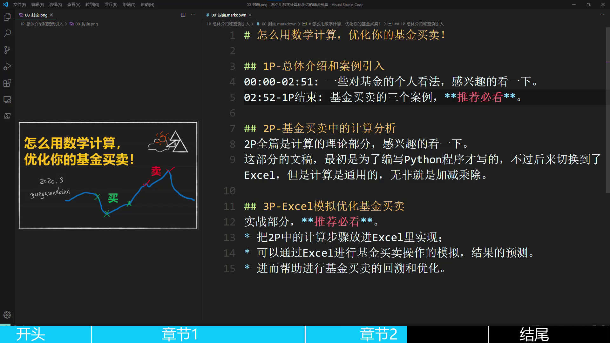

## 视频进度条生成工具

本工具是制作视频进度条的辅助小工具。

使用该工具配合AdobePremiere、Shotcut等常见视频编辑软件可以轻松实现下图所示的进度条效果：



### 功能介绍

工具的核心功能是：根据自定义的json配置文件，快速制作可以用在AdobePremiere、Shotcut等常见视频编辑器中使用的PNG图片。图片包括前景、背景和文本。

目前仅为命令行版本。

### 使用方法

解压程序后，会看到以下文件：

```shell
VideoProgressBarTool-Windows.exe
configs.json
videoStruct.json
```

`VideoProgressBarTool-Windows.exe`为主程序，`configs.json`和`videoStruct.json`为配置文件，使用记事本就可以打开编辑，各项含义见后面的高级设置。

在该目录下，文件资源管理器的地址栏上删除原路径后输入`cmd`打开命令行，输入

```shell
VideoProgressBarTool-Windows.exe hello
```

将会生成符合要求的PNG图片：

```shell
01-text-hello.png
02-foreground-hello.png
03-background-hello.png
04-all-hello.png
```

### 高级设置

`configs.json`配置进度条图片素材的分辨率等信息，部分内容如下

```json
{
    "configName":  "test",
    "ForegroundColor": "black",
    "BackgroundColor": "deepskyblue",
    "Coloralpha": 255,
    "processBarHeight": 54,
    "textSize": 46,
    "textPositionX":100,
    "textPositionY":4,
    "textFontName":"c:\\windows\\fonts\\msyh.ttc",
    "textColor": "white",
    "textContent": "hi"
}
```

各项依次的含义为：

```shell
设置名，前景色，背景色，颜色透明度（暂未支持，无效参数），进度条高度（像素），文本大小（像素），文本距左侧边缘距离（像素，暂为无效参数），文本据进度条顶端距离（像素），字体位置（微软雅黑，windows7请设置为"c:\\windows\\fonts\\msyh.ttf"），文本内容（暂为无效参数）。
```

`videoStruct.json`配置视频结构，例如默认配置为：

```json
{
    "timeLine":
    [
        {
            "partId":0,
            "startTime":0,
            "endTime":100,
            "text":"Hello world!"
        },
        {
            "partId":1,
            "startTime":0,
            "endTime":15,
            "text":"开头"
        },
        {
            "partId":2,
            "startTime":15,
            "endTime":50,
            "text":"章节1"
        },
        {
            "partId":3,
            "startTime":50,
            "endTime":80,
            "text":"章节2"
        },
        {
            "partId":4,
            "startTime":80,
            "endTime":100,
            "text":"结尾"
        }
    ]
}
```

含义为：目标视频总长100s，0-15s为开头，15-50s为章节1，依次类推。

**注意：第一段配置必须定义视频总长，且至少包括合法的第二、三段配置，仅有第一、二段配置无效**