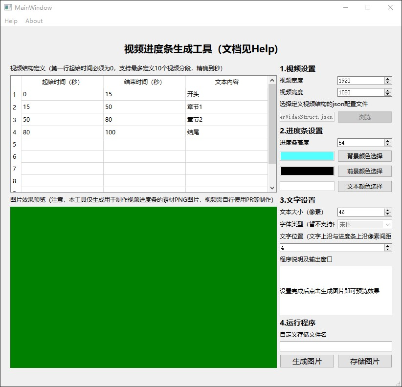
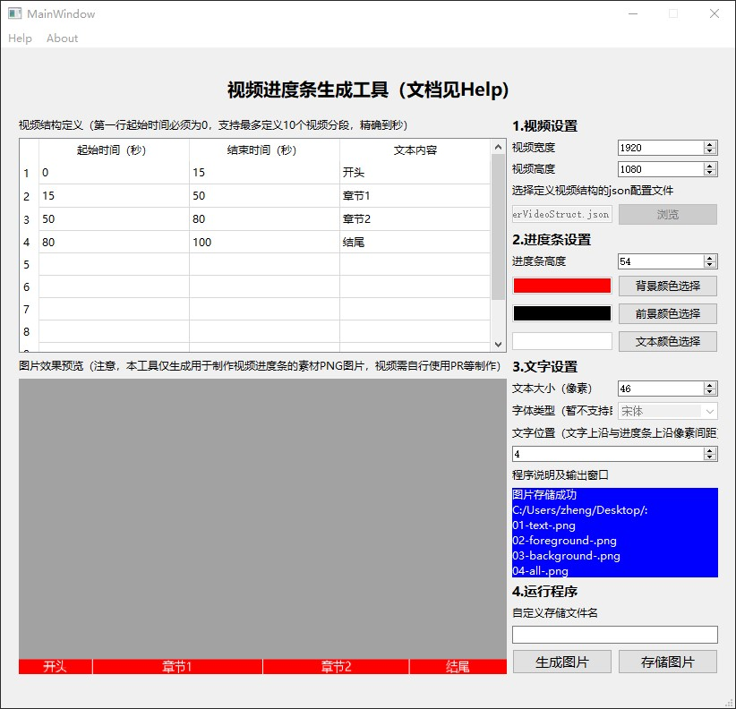
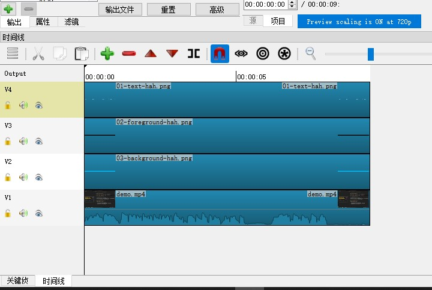

# VideoProgressBarTool-Windows
Video Progressbar Tool for windows

## 工具下载链接

该工具使用Python开发，使用了PIL和PyQt库，目前为**Beta1版本**，支持图形界面配置大部分参数，支持windows平台。

目前工具尚在测试阶段，源码暂不放出，仅提供工具beta1版本的下载链接：

点击[这里](https://github.com/ZhengMingpei/VideoProgressBarTool-Windows/releases/tag/beta1))即可下载。

## 视频进度条生成工具

本工具是制作视频进度条的辅助小工具。

使用该工具配合AdobePremiere、Shotcut等常见视频编辑软件可以轻松实现下图所示的进度条效果：


### 功能介绍

工具的核心功能是：根据自定义配置，快速制作可以用在AdobePremiere、Shotcut等常见视频编辑器中使用的PNG图片。图片包括前景、背景和文本。

### 注意

**默认字体为微软雅黑，暂时无法更改，字体所在目录应为`c:\\windows\\fonts\\msyh.ttc`，路径不对的请自行放置到该目录。**

### 工具使用方法

解压后，会得到以下文件：

```shell
VideoProgressBarTool-Windows-x64-beta1.exe # 工具主体，双击打开运行
userVideoStruct.json   # 工具对视频内容结构的初始配置
mainWindow6.ui         # 工具的界面布局文件，没错，是第六个版本的UI。
```

上述三个文件必须在同一个目录下，json配置文件可以进行合理修改，使用记事本就可以打开编辑。

运行`VideoProgressBarTool-Windows-x64-beta1.exe`后界面如下：



进行参数配置后点击**生成图片按钮**即可预览进度条效果，生成无误以后可以点击**存储图片按钮**指定目录存储图片,运行效果如下图：



正常运行后，若指定文件名为`hello`，则将会生成符合要求的PNG图片：

```shell
01-text-hello.png
02-foreground-hello.png
03-background-hello.png
04-all-hello.png
```

## 应用工具制作视频进度条

详情见本人的[B站视频介绍](https://space.bilibili.com/32918983)

在视频素材完成剪辑后，使用本工具生成符合素材结构的PNG图片，并将01、02和03图片分别拖入视频编辑软件中，并使三个图片各自占用一条视频轨道，叠放在你自己的视频素材轨道上方。

叠放示例如图：



然后对02图片所在的轨道加入诸如矩形裁切之类的滤镜操作，并在视频开始和结束各做1个关键帧，需要保证02图片从视频开始到结束，匀速向右移除，从而露出03图片轨道的进度条。

最后输出视频即可。
